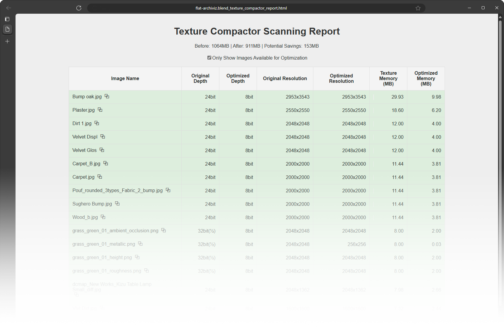

# Overview
This Blender addon automatically optimizes textures to lower memory usage when rendering in Cycles.

WARNING: This is a tool I wrote for myself and is in preview stage. Please back up your Blender file before running this addon in case the addon does something stupid.

# Install
1. Tap on the green "Code" button at the top of the page and then select "Download Zip".
2. Use the Blender preference panel to install the the zip file.

# How to Use Texture Compactor
Open a Blender file, Click on "Scan All Textures", after the computer is finished thinking, you can decide how aggressive you want to optimize your textures based on the memory estimate it provides.

When you click on "Optimize Textures", the addon will write the optimized textures to a separate folder called TC_Optimized, and redirect the image datablock to the new path, your source texture is never touched.

There is also a nifty reporting feature that give you an itemized list of all the textures:

# Why?
I was surprised to learn that the size of the image on disk does not influence memory usage of these textures at render time. Because the textures are uncompressed while rendering, memory usage is entirely determined by the resolution and bit depth of the texture in memory. For example, an 8K RGBA PNG might be 10KB in file size on disk, but when loaded by Cycles it will always take up exactly 256MB.

The goal of this addon is to reduce memory usage, so bigger and more complex scenes can be rendered on the GPU and CPU without running out of memory.

# How it works
Texture compactor actually looks at the content of your textures and make sure that the bits are used as efficiently as possible. Currently it does this through two ways:
1. Ensure that you are not accidentally using 24 or 32bit images when 8bit will suffice.

2. Ensure that the texture has enough detail to justify its size. Commercial assets often comes with 4k texture maps that is a single color, these can be downscaled significantly without any quality loss.

No AI is involved, it's just some basic math.

### Can't I just manually adjust the format of my textures?
Absolutely. I've done plenty of manually inspection and resizing textures, this tool just automates that for the entire Blender file at once.

### Can you optimize packed textures?
No. The optimization technique used here only works on unpacked images. For reasons that's unclear to me, packed textures actually use more memory at render time than their unpacked counterparts. 

### Do you support UDIMM or image sequences?
Not yet, but that's planned.

### Does this optimization technique apply to Eevee or other rendering engines?
Yes. Furthermore, Eevee can take advantage of compressed textures, such as the DirectDraw Surface (DDS) format with DXT1 or DXT5 compression. These formats can reduce GPU memory consumption by more than half compared to PNGs.  This will be implemented later.

### Does this tool do distance-based optimization?
No, this tool does not use any view-dependent or LOD based optimization. This is intentional to allow maximum creative flexibility.
